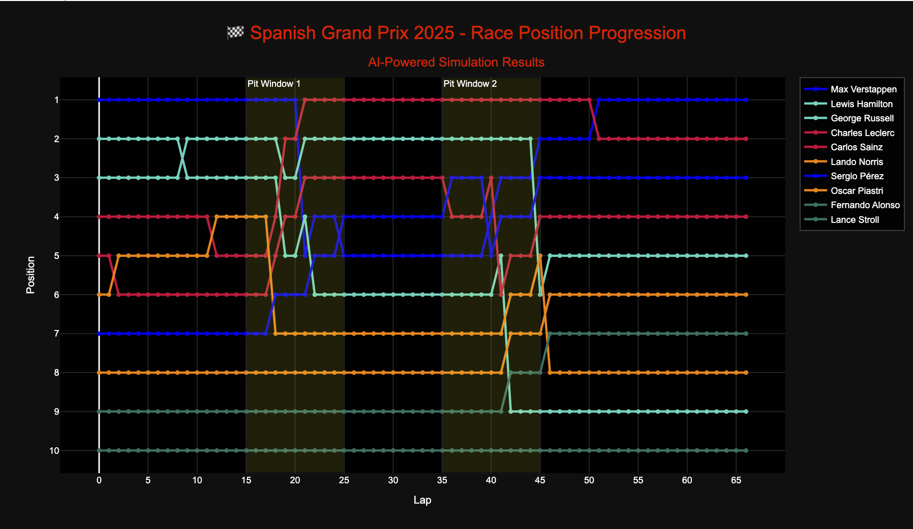
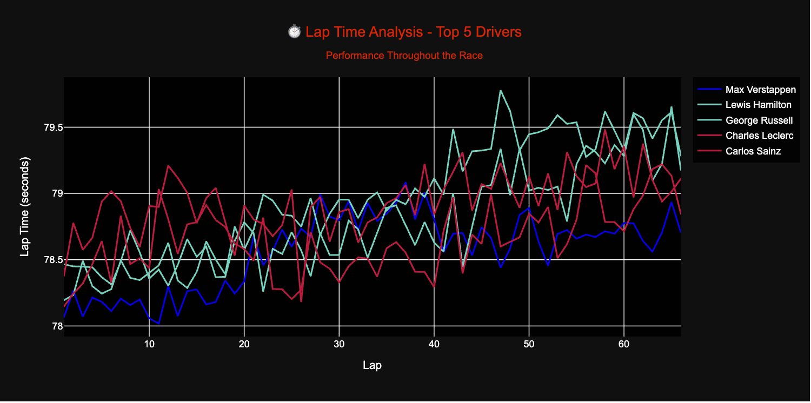
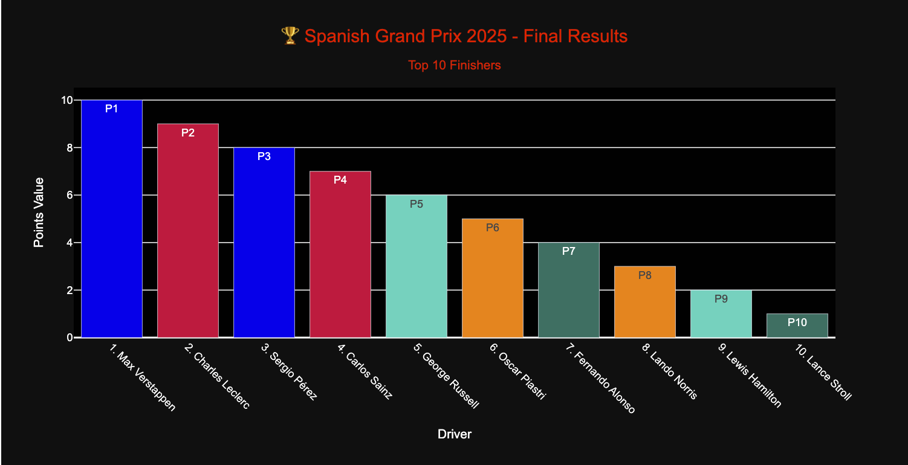

# 🏁 Agentic AI Simulation - Formula 1 Spanish Grand Prix 2025

Live App: [Streamlit Dashboard](https://shivramsriramulu-agentic-ai-f1-spanish-gp.streamlit.app/)

## 📌 Overview

This project simulates the **Spanish Grand Prix 2025** using **Agentic AI systems**, AI-predicted data, and realistic race logic to analyze driver performance, strategies, and race results.

The simulation uses a multi-agent setup, predictive metrics, and interactive Streamlit dashboards to visualize driver positions, lap times, and final outcomes. It leverages historical F1 data, performance analytics, and weather-strategy integration.

---

## 🚀 Features

- 🎮 **Race Simulation Engine** with lap-by-lap driver dynamics
- 📊 **Interactive Dashboards** (Lap Times, Race Positions, Final Results)
- 🧠 **Agentic AI Modules** coordinating race prediction tasks
- 📈 **Realistic Data Inputs** based on AI performance metrics
- ☀️ **Weather & Circuit Strategy Modeling**
- 🏎️ **F1-Specific Driver Skills, Consistency, Team Factors**

---

## 🧠 Agentic AI System

The simulation is powered by a set of intelligent agents, each with specialized roles:

### 🕵️ Data Agent
- Gathers and preprocesses driver statistics, historical race data, and Barcelona circuit performance.
- Uses pre-engineered JSON (`spanish_gp_2025_results.json`) to provide:
  - Quali & Race consistency
  - Avg position metrics
  - Points per race
  - Circuit-specific performance

### 📊 Race Simulation Agent
- Simulates lap-by-lap driver performance.
- Accounts for:
  - Driver skill & consistency
  - Pit window strategies
  - Tire degradation
  - Random overtakes and track incidents

### 📈 Visualization Agent
- Generates high-quality charts using Plotly:
  - Driver position progression chart
  - Lap time analysis for top 5 drivers
  - Final podium and Top-10 bar chart

### 📋 Analysis & Strategy Agent
- Summarizes weather effects, team dynamics, and technical reliability.
- Outputs tactical advantages for Red Bull, Mercedes, and Ferrari using predefined heuristics.

---

## 📂 Project Structure

F1_SpanishGP/
│
├── Main.py # Main simulation + plotting code
├── spanish_gp_2025_results.json # AI-analyzed driver/circuit metadata
├── raceposition.png # Driver Position Progression Chart
├── top5.png # Top 5 Lap Times Chart
├── top10bar.png # Final Top 10 Bar Chart
├── streamlit_app.py # Streamlit frontend code
├── README.md # You're reading this :)


---

## 📊 Dashboard Preview

- **Race Position Chart**
  

- **Lap Time Analysis**
  

- **Final Results**
  

---

## 📦 Tech Stack

- **Python 3.9+**
- **Streamlit** (UI/Deployment)
- **Plotly** (Interactive Visualizations)
- **Kaleido** (Image Export)
- **NumPy / Pandas** (Data Handling)
- **Custom JSON** for AI performance metadata

---

## 📁 Data & Preprocessing

- Input data was precomputed and saved in `spanish_gp_2025_results.json`:
  - Metrics used: `points_per_race`, `avg_quali_position`, `quali_consistency`, `avg_finish_position`, etc.
  - Historical performance at Barcelona is incorporated.
- Lap-level simulation logic includes:
  - Skill-variance modeling
  - Position-based penalties
  - Pit stop reordering
  - Random events & tire wear

---

## 🎯 Key Insights from Simulation

> Based on the simulation and prediction report:

- 🥇 **Winner:** Max Verstappen (Red Bull)
- 🥈 **Runner-Up:** Lewis Hamilton (Mercedes)
- 🥉 **Third Place:** George Russell (Mercedes)

> Drivers with the best points-per-race:
- George Russell (15.67)
- Charles Leclerc (15.00)
- Max Verstappen (14.33)

> Circuit experts at Barcelona:
- Verstappen: Avg Pos 1.3
- Hamilton: Avg Pos 2.7
- Pérez: Avg Pos 3.7

> Weather is mostly clear, favoring aerodynamic efficiency and consistent teams like Red Bull & Mercedes.

---

## 🔗 Setup Instructions

1. Clone the repo:

```bash
git clone https://github.com/ShivramSriramulu/spanish-gp-2025-ai.git
cd spanish-gp-2025-ai


pip install -r requirements.txt

streamlit run streamlit_app.py


🌐 Streamlit Deployment
Deployed to:
🔗 https://shivramsriramulu-agentic-ai-f1-spanish-gp.streamlit.app/

Streamlit is used for:

Uploading and processing the JSON

Displaying race simulation visualizations

Highlighting podium outcomes and driver insights

👨‍💻 Author
Shivram Sriramulu
🎓 Master’s in Data Analytics, San Jose State University
🚀 AI x Sports Enthusiast | Predictive Modeling | MLOps
🔗 GitHub: ShivramSriramulu

📜 License
This project is licensed under the MIT License. See LICENSE file for details.
